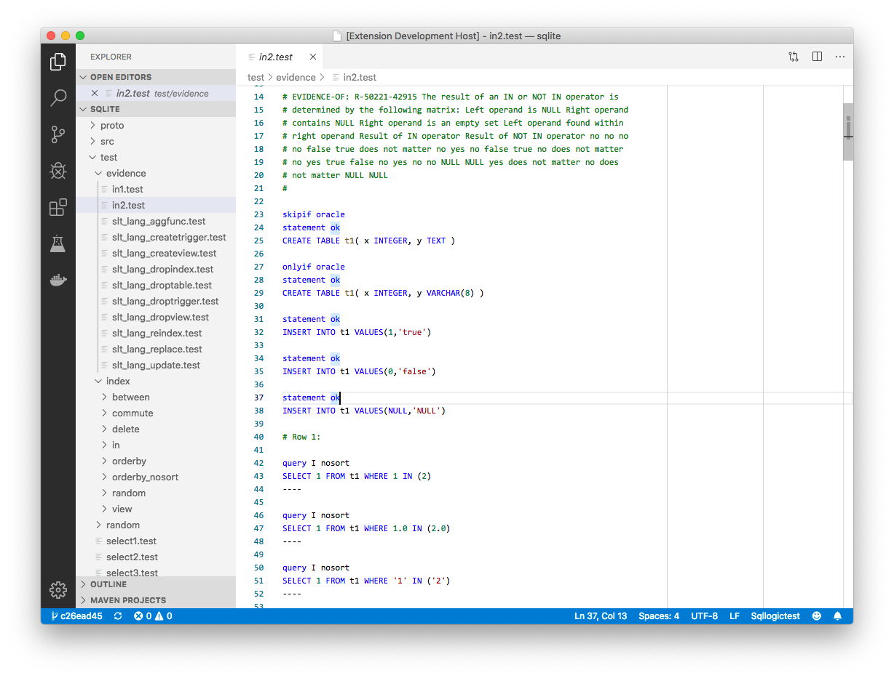

# vscode-sqllogictest

This is an extension for [Visual Studio Code][vscode] that provides language
support for [sqllogictest], a text-driven testing framework for SQL databases.

## Features

The headline feature of this extension is syntax highlighting for sqllogictest
scripts:

Because there is no standard file extension for sqllogictest scripts,
vscode-sqllogictest will run some heuristics on plaintext files to determine
whether to place them into sqllogictest mode. These heuristics are fairly
primitive, so please file issues if you find sqllogictest files that are not
detected as such, or vice versa.

## Installation

[Install via the VSCode Extension Marketplace][marketplace].

[marketplace]: https://marketplace.visualstudio.com/items?itemName=benesch.sqllogictest
[sqllogictest]: https://www.sqlite.org/sqllogictest/doc/trunk/about.wiki
[vscode]: https://code.visualstudio.com
